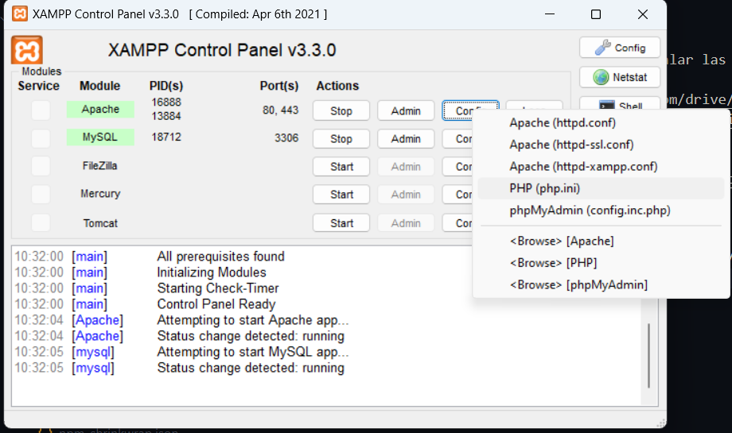
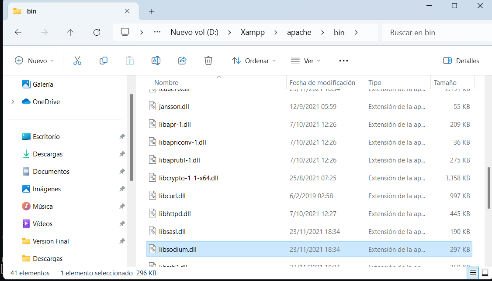
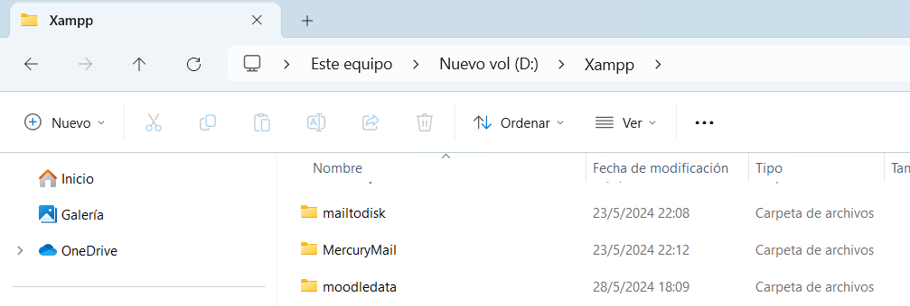
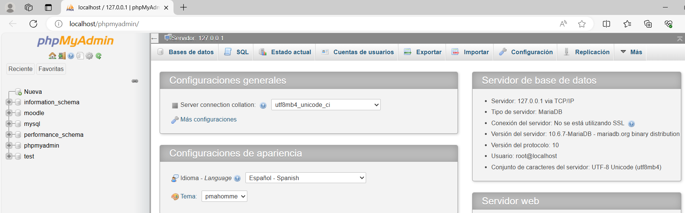
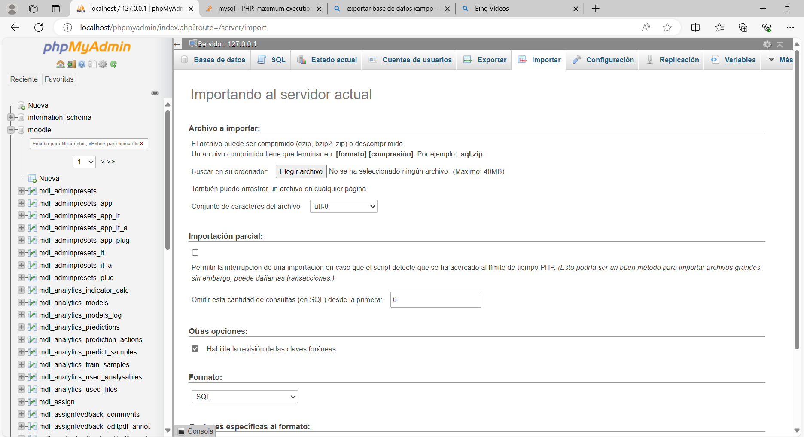

# REQUERIMIENTOS 
Antes de clonar el repositorio debe instalar las siguientes dependencias
- Xampp 8.1.0 ->  https://drive.google.com/drive/folders/17royg2ImCcvhisy9sl23AAcDnHl3IPgz?usp=drive_link
- PHP 8.1: Viene con xampp
- MariaDB 10.6.7: Hay que descargar y cambiar la versión https://www.youtube.com/watch?v=-GmyjYEfuzE

# INSTALACIÓN 
1. Clonar el proyecto en la carpeta `xampp/htdocs`, y luego cambiar el nombre de la carpeta a `tss-lms` con minusculas
2. Reemplace el archivo `php.ini` en la carpeta `xampp/php` este ya viene con los cambios para añadir las extensiones

 
3. Copie la extensión libsodium.dll en la carpeta `xampp/apache/bin`

4. Descomprimir el zip moodledate.zip en la carpeta `xampp/moodledata`

5. Crear la base de datos `moodle`

6. Importar el archivo moodle.sql en phpMyAdmin -> **IMPORTANTE:** Debe deshabilitar la opción de importación parcial 

# ARRANCAR MOODLE 
1. Abra Xampp
2. Arranque los servicios de Apache y MySQL
3. En su navegador ponga `http://localhost/tss-lms/moodle`
